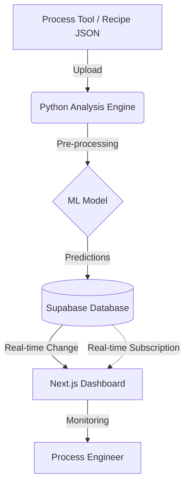

# [Research Report] AI-based Metasurface Fabrication Yield Prediction and Defect Metrology System

  

  <b>React/Next.js (Frontend) • AI-based Yield Prediction • Semiconductor Fab Intelligence</b>

---

## 1. Research Background: Challenges in Nano-fabrication

초미세 나노 스케일의 메타표면(Metasurface) 제조 공정은 극도로 높은 정밀도를 요구하며, 미세한 공정 변수 변화가 최종 소자의 광학적 성능 및 수율(Yield)에 결정적인 영향을 미친다. 특히 **E-beam Lithography (EBL)** 및 **Etching Process** 과정에서 발생하는 **Dose, Pressure, Temperature, Gas Flow Rate** 등의 파라미터는 상호 복합적인 비선형 관계를 형성하며, 이는 설계치(Design Rule)와 실제 제작된 패턴 간의 치수 오차(Critical Dimension error)를 유발한다.

기존의 물리적 계측 방식(Physical Metrology)은 높은 비용과 긴 측정 시간으로 인해 양산 라인에서의 실시간 피드백에 한계가 있다. 이를 극복하기 위해 본 연구에서는 **가상 계측(Virtual Metrology)** 시스템을 도입한다. 가상 계측은 실제 웨이퍼가 공정을 통과하기 전/후의 센서 데이터 및 환경 변수를 활용하여 소자의 성능을 통계적으로 예측함으로써, 공정 중단 없이(Non-destructive) 수율을 최적화하고 공정 윈도우(Process Window)를 확보하는 데 필수적인 기술이다.

---

## 2. Yield Prediction Methodology

본 시스템은 공정 레시피 파라미터(Process Recipe Parameters)와 실제 측정된 효율(Measured Efficiency) 사이의 상관관계를 다차원으로 분석한다. 수율 예측은 지도 학습(Supervised Learning) 기반의 회귀 모델을 활용하며, 수율의 정량적 산출 공식은 다음과 같이 정의된다.

$$\text{Yield (\%)} = \left( \frac{N_{\text{pass}}}{N_{\text{total}}} \right) \times 100$$

여기서 $N_{\text{pass}}$는 기 설정된 효율 임계값(Efficiency Threshold)을 만족하는 유닛의 수이며, $N_{\text{total}}$은 전체 샘플 수를 의미한다. 

예측 성능의 정밀도를 확보하기 위해 **Random Forest**와 **XGBoost(Extreme Gradient Boosting)** 앙상블 알고리즘을 적용하며, 가중치 최적화를 통해 결정 계수($R^2$) 및 평균 제곱근 오차(RMSE)를 최소화한다. 또한 **Feature Importance (SHAP Analysis)** 로직을 내장하여 수율 저하에 지배적인 영향을 미치는 핵심 인자(Critical Factors)를 식별하고, 이를 기반으로 공정 편차를 최소화하는 최적 레시피를 도출한다.

---

## 3. System Architecture & Fab Monitoring Pipeline

시스템은 데이터 전처리 및 분석을 위한 **Python 엔진**과 실시간 공정 모니터링을 위한 **Next.js 대시보드**의 유기적인 결합으로 구성된다. 공정 중 생성되는 Recipe JSON 로그 데이터는 정규화(Normalization) 및 원-핫 인코딩(One-hot Encoding)을 거쳐 예측 모델에 입력된다.

데이터의 무결성(Data Integrity) 확보와 예측 결과의 즉각적인 동기화를 위해 **Supabase Real-time** 아키텍처를 채택하였다. 공정 엔지니어는 대시보드를 통해 실시간 수율 변동 및 위험 지표를 모니터링할 수 있다.

---

## 4. Computer Vision for Defect Metrology

패턴 형성 과정에서 발생하는 미세 결함을 식별하기 위해 **SEM(Scanning Electron Microscope)** 이미지 분석용 Vision AI 모듈을 탑재한다. 본 모듈은 나노 구조체 간의 **Bridge(브릿지)** 현상이나 **Broken Pattern(단선)** 등을 딥러닝 기반의 합성곱 신경망(CNN)을 통해 자동 탐지(Detection) 및 분류(Classification)한다.

이미지 기반의 결함 밀도(Defect Density) 분석 결과는 공정 단계별 상태와 연동되어, 이상 징후가 감지될 경우 즉각적인 알림을 송출한다. 이를 통해 엔지니어는 공정 변수(Dose, Development time 등)를 역으로 추적하여 소멸성 결함을 방지하고, 최적의 공정 윈도우를 동적으로 재설정할 수 있다.

---

## 5. Implementation & Scalability

시스템의 안정적 구동 및 대규모 데이터 처리를 위한 환경 설정은 다음과 같다.

- **Backend Logic**: Python 3.10+ 환경에서 Scikit-learn, PyTorch, OpenCV 라이브러리를 통해 수율 예측 및 이미지 분석을 수행한다.
- **Hardware Acceleration**: 대용량 공정 데이터셋 학습 및 고해상도 SEM 이미지 추론 시, Apple Silicon Mac의 **Metal Performance Shaders (MPS)** 가속을 활용하여 연산 속도를 최적화한다.
- **Frontend Interface**: Node.js 18+ 기반의 Next.js 14 및 Tailwind CSS를 사용하여 반응형 및 저지연(Low-latency) 모니터링 환경을 제공한다.

---

**Author: 권해성 (Hanyang University, Computer Science)**
**Research Interest: Virtual Metrology, Nano-process Intelligence, Semiconductor Yield Analysis**
